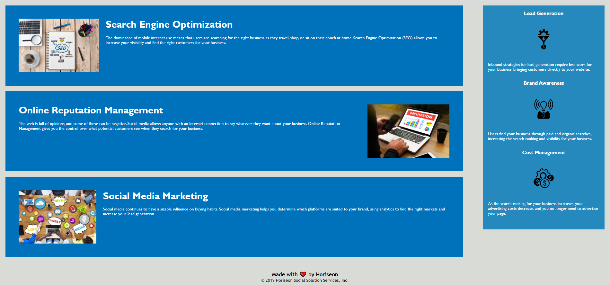

# Horiseon Website

## Description
Homework assignment 1 contains the following features:

* This website shows good use of semantic HTML and optimized CSS

* All images are housed within a sub-folder of the assets folder

* Alt attributes are applied to make the website accessible

## Visuals

See below for a preview of the web page:

## Links

Please find the deployed application here: https://stephenson36.github.io/HW1_SS/